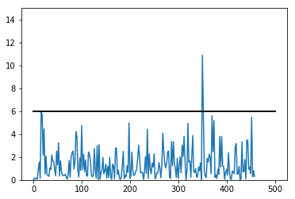
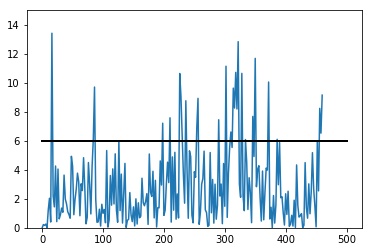
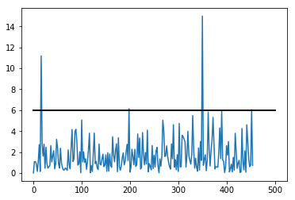
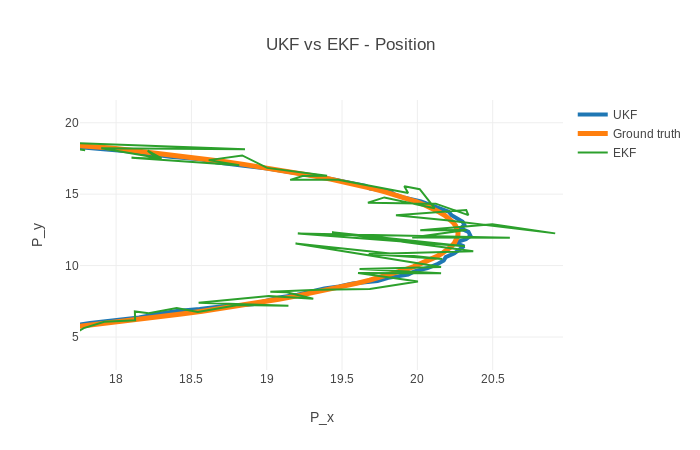
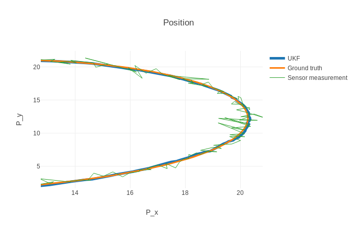
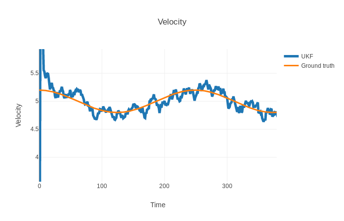
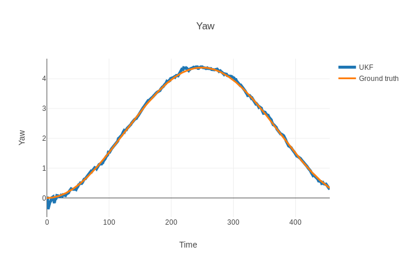
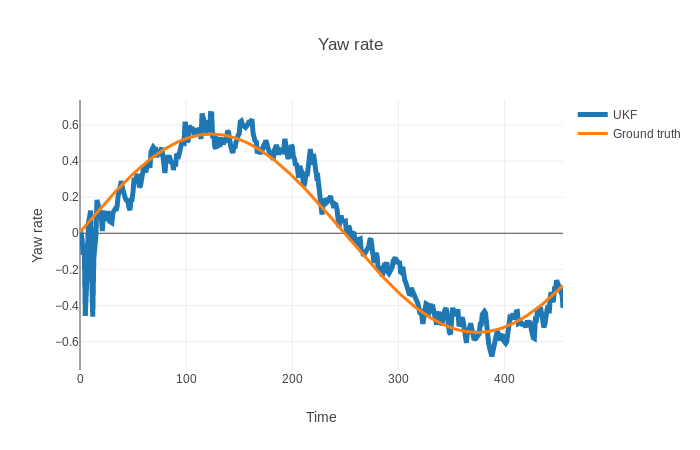
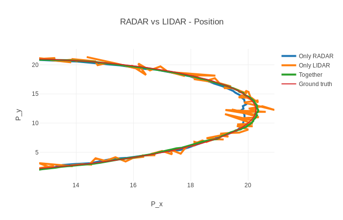

# Unscented Kalman Filter Project
Self-Driving Car Engineer Nanodegree Program

Implementing an Unscented Kalman filter to estimate the state of a moving object with noisy LiDAR and radar measurements. The project employs the simulation environment provided by UDACITY which can be downloaded from [here](https://github.com/udacity/self-driving-car-sim/releases).

This repository includes two files that can be used to set up and intall [uWebSocketIO](https://github.com/uWebSockets/uWebSockets) for either Linux or Mac systems. For windows you can use either Docker, VMware, or even [Windows 10 Bash on Ubuntu](https://www.howtogeek.com/249966/how-to-install-and-use-the-linux-bash-shell-on-windows-10/) to install uWebSocketIO.

Once the install for uWebSocketIO is complete, the main program can be built and ran by doing the following from the project top directory.

1. cd build
2. cmake ..
3. make
4. ./UnscentedKF output_file_name.txt

_NOTE: The script will save all the data in the provided output file in order to analyze the results and generate the figures below. The files [Tuning_NIS.ipynb](./Tuning_NIS.ipynb) and [Visualizing.ipynb](./Visualizing.ipynb) can be used to visualize the filter performance and interact with the figures._

## Other Important Dependencies
* cmake >= 3.5
  * All OSes: [click here for installation instructions](https://cmake.org/install/)
* make >= 4.1 (Linux, Mac), 3.81 (Windows)
  * Linux: make is installed by default on most Linux distros
  * Mac: [install Xcode command line tools to get make](https://developer.apple.com/xcode/features/)
  * Windows: [Click here for installation instructions](http://gnuwin32.sourceforge.net/packages/make.htm)
* gcc/g++ >= 5.4
  * Linux: gcc / g++ is installed by default on most Linux distros
  * Mac: same deal as make - [install Xcode command line tools](https://developer.apple.com/xcode/features/)
  * Windows: recommend using [MinGW](http://www.mingw.org/)

## Tuning process noise

It was important to tune the _process noise_ parameters (_std_a_ & _std_yawdd_) in order to get the filter working properly. NIS (_Normalized Innovation Squared_) was used to analyze the results and adjust the noise estimates. The main idea is that only around 5% of the NIS values computed after receiving each sensor measurement should be above the 95% confidence line presented in the figures below. Having few points above the line indicate that we may be overestimating the uncertainty in the process, while having too many values indicate the opposite.

<table>
  <tr>
    <td align="center">Overestimating uncertainty</td>
    <td align="center">Underestimating uncertainty</td>
    <td align="center">Tuning noise parameters</td>
  </tr>
  <tr>
    <td>&sigma;longitudinal acceleration = 30 m/s2   &sigma;yaw acceleration = 30 rad/s2</td>
    <td>&sigma;longitudinal acceleration = 0.1 m/s2   &sigma;yaw acceleration = 0.1 rad/s2</td>
    <td>&sigma;longitudinal acceleration = 1 m/s2   &sigma;yaw acceleration = 0.8 rad/s2</td>
  </tr>
  <tr>
    <td></td>
    <td></td>
    <td></td>
  </tr>
</table>

## RMSE results before and after tuning

<table>
  <tr>
    <td align="center">Name</td>
    <td align="center">RMSE X</td>
    <td align="center">RMSE Y</td>
    <td align="center">RMSE Vx</td>
    <td align="center">RMSE Vy</td>
  </tr>
  <tr>
    <td>Overestimating noise</td>
    <td>0.094</td>
    <td>0.120</td>
    <td>0.861</td>
    <td>0.942</td>
  </tr>
  <tr>
    <td>Underestimating noise</td>
    <td>0.126</td>
    <td>0.130</td>
    <td>0.432</td>
    <td>0.303</td>
  </tr>
  <tr>
    <td><b>Tuning noise parameters</b></td>
    <td><b>0.064</b></td>
    <td><b>0.083</b></td>
    <td><b>0.333</b></td>
    <td><b>0.238</b></td>
  </tr>
</table>

## Comparing UKF to EKF

We can also compare the performance of the UKF with our previous EKF [project](https://github.com/camigord/Extended_Kalman_Filter). The figure below shows that UKF performs significantly better than the EKF, although it is important to clarify that we did not tune the EKF parameters.

## UKF performance

Here we can compare the UKF estimates to the ground truth provided by the simulator.

<table>
  <tr>
    <td></td>
    <td></td>
  </tr>
  <tr>
    <td></td>
    <td></td>
  </tr>
</table>

## Which sensor is better?

It is hard to say if one sensor in particular is better than the other provided the results below. Radar measurements seem to generate smooth estimates, but LiDAR measurements follow the ground truth more closely (specially during curves). We can conclude, however, that fusing the measurements from both sensors results in more accurate estimates.

